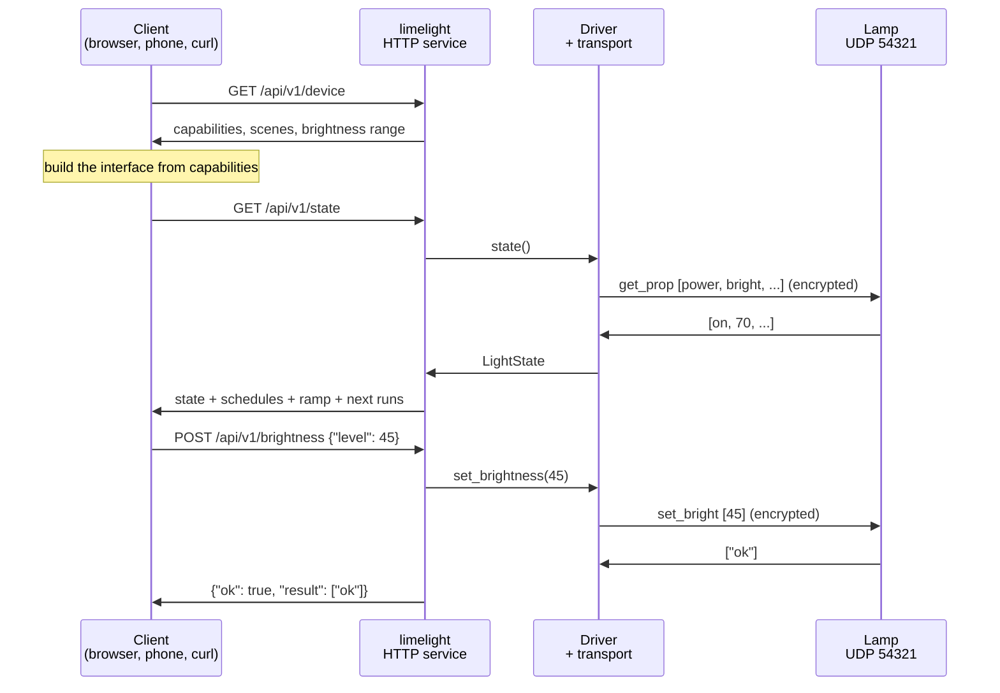

<div align="center">

# limelight

**Local control for Xiaomi-ecosystem smart lights over the miIO protocol.**

[](https://github.com/smartwhale8/limelight/actions/workflows/ci.yml)
[](https://www.python.org/downloads/)
[](https://github.com/smartwhale8/limelight/blob/main/LICENSE)

</div>

---

limelight controls a smart light directly over your local network. It provides a web
interface, a versioned JSON API, and a command line tool. It contacts no external service:
every command is a UDP datagram sent from your machine to the device.

## Contents

- [What it does](#what-it-does)
- [Supported devices](#supported-devices)
- [How it works](#how-it-works) — the concepts, from networking up
- [Install](#install)
- [Adopting a device](#adopting-a-device)
- [Running the service](#running-the-service)
- [Command line](#command-line)
- [Authentication](#authentication)
- [Timed behaviour and its one limitation](#timed-behaviour-and-its-one-limitation)
- [Running it permanently](#running-it-permanently)
- [Documentation](#documentation)

## What it does

|  | |
|---|---|
| **Web interface** | Any browser, including a phone on the same network. Dark and light themes. |
| **Android app** | Standalone client in [`android/`](https://github.com/smartwhale8/limelight/tree/main/android), talking to the lamp directly over miIO with no server running. Download the APK from [Releases](https://github.com/smartwhale8/limelight/releases). |
| **JSON API** | Versioned at `/api/v1`, with an OpenAPI schema for generating clients. |
| **Command line** | Every function scriptable, suitable for cron or other automation. |
| **Sunrise wake-up** | Gradual brightness ramp over any duration. |
| **Fade to sleep** | Gradual dim to off. |
| **Sleep timer** | The device's own countdown, which continues if limelight stops. |
| **Schedules** | Recurring actions per weekday, with the next firings listed. |
| **Device control** | Power, brightness, eyecare mode, ambient light, four scenes, night light, fatigue reminder. |

## Supported devices

| Model | Product | Verified on |
|---|---|---|
| `philips.light.sread1` | Philips Eyecare Smart Lamp 2 | Firmware 1.2.8, MCU 0026, Wi-Fi 1.4.0 |

Hardware details for that model:

| Property | Value |
|---|---|
| Controller | ESP8266 |
| Radio | 2.4 GHz only; the chip has no 5 GHz support |
| Transport | UDP port 54321 |
| Open TCP ports | None. Ports 22, 23, 80, 443, 1883, 6668, 8080 and 8443 are all closed. |
| Encryption | AES-128-CBC, key derived from a 16-byte device token |
| Lights | Main LED panel and a separate ambient LED in the base |
| Brightness range | 1 to 100, both lights |
| Scenes | 3 fixed. Their effect is not exposed by the protocol, so they are reported as Scene 1 to 3. |
| Colour | None. Fixed white, no colour temperature control. |
| Native transitions | None. Every command takes effect immediately. |
| State notification | None. State must be polled. |

Adding another miIO light is a new file in `limelight/drivers/`. See
[docs/DEVICES.md](https://github.com/smartwhale8/limelight/blob/main/docs/DEVICES.md).

---

## How it works

The concepts, in the order they matter. Byte-level detail lives in
[docs/PROTOCOL.md](https://github.com/smartwhale8/limelight/blob/main/docs/PROTOCOL.md); this is the orientation.

### What miIO is

**miIO** is the local control protocol spoken by devices in Xiaomi's smart home ecosystem,
its name a contraction of *Mi* and *IO*. Xiaomi has never published a specification, so
everything known about it publicly comes from reverse engineering.

Two properties explain things that otherwise look odd here.

**The brand on the box does not determine the protocol.** Xiaomi runs an ecosystem
programme in which partner manufacturers build hardware that registers with the Mi Home
application, so a Philips-branded lamp is addressed exactly like a Xiaomi air purifier.
Each device carries a model identifier of the form `vendor.category.model`:

```
philips.light.sread1
   |      |      |
   |      |      +-- model, this specific product
   |      +--------- category, a light
   +---------------- vendor within the ecosystem programme
```

That identifier, not the brand, selects a driver.

**There are two generations.** Legacy miIO addresses properties by string name through
`get_prop`; MIoT-Spec-V2 addresses them numerically through `get_properties` with a service
and property id. Both use the same transport, so the difference is purely a driver concern.
This lamp is a legacy device.

A cloud path over HTTPS also exists for devices bound to a Xiaomi account. limelight never
uses it, and provisions with `uid=0` specifically to avoid creating that binding.

### Access points, and the two modes a device can be in

An **access point** is the radio other devices associate with to form a Wi-Fi network. Your
router runs one; its network name is the SSID you pick from a list.

**Infrastructure mode** is the normal state: the device joins your router's access point and
DHCP gives it an address on your subnet, such as `192.168.1.42`.

**SoftAP mode** is the setup state. A device with no stored Wi-Fi credentials cannot join
anything, so it runs an access point *of its own* and waits for you to connect to it. The
SSID encodes what it is, and `_miap` marks it as a miIO setup network:

```
philips-light-sread1_miapXXXX
```

Two consequences: your machine loses internet while joined to it, and **this device's setup
network advertises no default gateway**, so code that derives the device address from the
routing table finds nothing. It answers on `192.168.4.1`. That detail defeated the first
adoption attempt and is why [docs/ADOPTION.md](https://github.com/smartwhale8/limelight/blob/main/docs/ADOPTION.md) exists.

### Addressing: the device id matters more than the IP

Addresses come from DHCP and move. Every miIO device also has a **device id**, a 32-bit
integer fixed for the life of the hardware. limelight stores both, and when commands start
failing it re-runs discovery, matches on the device id, and updates the address by itself.

### Transport: why UDP means retries

Commands are **UDP datagrams to port 54321**. UDP is connectionless, with no delivery
acknowledgement, which has one consequence worth internalising:

> A lost datagram is indistinguishable from a dead device.

Every command is therefore retried with increasing backoff before being called a failure.
A rediscovery warning in the log usually means one datagram was dropped, not that anything
is broken.

### Authentication: the token

Access is controlled by a single **token**: 16 bytes, written as 32 hexadecimal characters.
There is no username, no password, and no per-command permission. Possession of the token is
complete control of the device.

The token is never transmitted. It seeds the encryption, with the key derived as
`md5(token)` and the IV as `md5(key + token)`, and the payload encrypted with AES-128-CBC.
A device that cannot decrypt a request simply does not answer, so a **wrong token presents
as an unreachable device** rather than as an authentication error.

### The handshake, and how a token is obtained

Before any encrypted exchange, a client sends a 32-byte **hello** with no payload. No
credential is involved, so any device on the subnet answers with its device id, and firmware
that discloses its token includes that too.

This is both the discovery mechanism and how a token is obtained without vendor software.
Whether it works depends on binding: a device that has never been registered to a Xiaomi
account discloses its token, and binding one regenerates it.

### Query and response

Payloads are JSON-RPC. A read asks for several properties at once and gets them back in
order:

```jsonc
// query
{"id": 1, "method": "get_prop", "params": ["power", "bright", "eyecare"]}
// response
{"result": ["on", 70, "off"], "id": 1}
```

A write names a method and its arguments, and answers `{"result": ["ok"]}`.

Reading everything in one datagram is not a nicety. The device is a single-threaded
microcontroller on a connectionless transport, and one request per property drops datagrams.

The full property list and command surface for this lamp is in
[docs/PROTOCOL.md](https://github.com/smartwhale8/limelight/blob/main/docs/PROTOCOL.md), including one coupling a client must respect:
**enabling eyecare hands brightness to the mode, and setting brightness cancels eyecare.**
The two cannot be held at once.

### Capabilities: how clients avoid hard-coding a feature set

Each driver declares what its device can do, and both the API and the Android app render
controls from that list rather than from assumptions:

```console
$ curl -s http://localhost:8765/api/v1/device | jq '.capabilities'
["ambient","ambient_brightness","brightness","eyecare",
 "night_light","power","reminder","scenes","sleep_timer"]
```

Three things follow. Clients build their interface from the list. Unsupported operations
return a clean HTTP 400 rather than a protocol error. And in `GET /api/v1/state`, only `on`
is guaranteed, so an absent key means the device has no such feature.

Capability strings are public API, and clients must ignore values they do not recognise, so
an older client keeps working against a newer device.

### Putting it together



The Android app removes the middle two participants: it speaks miIO to the lamp directly.

Further reading: [docs/PROTOCOL.md](https://github.com/smartwhale8/limelight/blob/main/docs/PROTOCOL.md) for the wire format,
[docs/ARCHITECTURE.md](https://github.com/smartwhale8/limelight/blob/main/docs/ARCHITECTURE.md) for how the code is layered, and
[docs/API.md](https://github.com/smartwhale8/limelight/blob/main/docs/API.md) for the HTTP contract.

## Install

Python 3.11 or newer.

From PyPI, once published:

```bash
pip install limelight-miio
```

The distribution is `limelight-miio` because PyPI does not accept the bare name. Everything
else stays `limelight`: `import limelight`, and the `limelight` and `limelight-server`
commands.

From a checkout, for development or to run the newest code:

```bash
git clone https://github.com/smartwhale8/limelight.git
cd limelight
python -m venv .venv && source .venv/bin/activate
pip install -e ".[server]" -c constraints.txt
```

`constraints.txt` pins the exact versions this project is built and tested against, so the
install is reproducible. `pyproject.toml` declares looser ranges, so limelight can still be
installed alongside other packages that need different versions.

## Adopting a device

**Adoption** means recording a device's address and token so limelight can command it.

If the device is already on your network and discloses its token, this is one step:

```bash
limelight discover --subnet 192.168.1.
limelight adopt --auto --name "Desk lamp"
```

`discover` reports which devices disclose a token:

```
  192.168.1.42  device_id=12345678  (token disclosed)
```

If it reports `token withheld`, or the device is unprovisioned and broadcasting its own
SoftAP, follow [docs/ADOPTION.md](https://github.com/smartwhale8/limelight/blob/main/docs/ADOPTION.md), which covers recovering the token over
the setup access point and handing the device your Wi-Fi credentials. Then:

```bash
limelight adopt --ip 192.168.1.42 --token 0123456789abcdef0123456789abcdef
```

Settings are written to `~/.config/limelight/config.json` at mode `0600`, because that file
holds the token.

## Running the service

```bash
limelight serve
```

Open <http://localhost:8765>, or `http://<your-machine-ip>:8765` from a phone on the same
network. `/docs` serves interactive API documentation and `/openapi.json` the schema.

## Command line

```bash
limelight status                          # current device state
limelight on --brightness 60
limelight off
limelight brightness 35
limelight scene 3                         # the device accepts 1, 2 or 3
limelight eyecare on
limelight ambient on --level 50
limelight timer 45                        # device countdown; survives limelight exiting
limelight sunrise --minutes 20 --target 100
limelight fade --minutes 30
limelight schedules
limelight capabilities                    # what this device supports
limelight info                            # raw miIO.info
limelight models                          # drivers available
```

## Authentication

limelight requires no authentication by default. Anything that can reach the port can
control the device.

To require a key:

```bash
export LIMELIGHT_API_KEY="$(openssl rand -hex 24)"
limelight serve
```

Clients then send `Authorization: Bearer <key>`, or `X-API-Key: <key>`. The web interface
prompts once and stores it. `GET /api/v1/health` stays unauthenticated so a client can
identify a service before pairing, and its `auth_required` field reports whether a key is
needed.

The key is a shared secret over plain HTTP. It identifies a client on a trusted network. Do
not forward the port to the internet; reach it through a VPN into your network instead.

A separate consideration applies to the device itself: this firmware discloses its token to
any unauthenticated request on the local network, so the device's real perimeter is your
Wi-Fi password. See [SECURITY.md](https://github.com/smartwhale8/limelight/blob/main/SECURITY.md).

## Timed behaviour and its one limitation

The device firmware implements exactly one timed feature: `delay_off`, a hard cut-off after
N minutes. **Gradual wake-up and gradual fade-out do not exist in the hardware.** limelight
produces them by stepping `set_bright` every five seconds, which has a consequence:

- A `sunrise` or `fade_off` ramp progresses **only while limelight is running**. If the
  host sleeps, the ramp stops where it was.
- A `timer` schedule uses the device's own countdown and survives limelight exiting, a
  reboot, or the host sleeping.

The API and the interface both mark which is which, through the `service_driven` field. For
a wake-up you depend on, run limelight on a machine that stays awake.

| Schedule kind | Behaviour | Survives limelight stopping |
|---|---|---|
| `sunrise` | On at 1%, ramping to the target over the duration | No |
| `fade_off` | Ramp down to 1% over the duration, then off | No |
| `on` | On, applying brightness, scene and ambient | Yes, it is instant |
| `off` | Off | Yes, it is instant |
| `timer` | Set the device countdown | **Yes**, the device tracks it |

## Running it permanently

So that schedules fire without the service being started by hand.

**macOS**, using `launchd`:

```bash
./packaging/launchd/install.sh
```

**Linux**, using `systemd`:

```bash
./packaging/systemd/install.sh
```

Each script prints what it will do before doing it, and each has a matching
`uninstall.sh`.

## Documentation

| Document | Contents |
|---|---|
| [docs/PROTOCOL.md](https://github.com/smartwhale8/limelight/blob/main/docs/PROTOCOL.md) | miIO on the wire, packet layout, crypto, full command set |
| [docs/API.md](https://github.com/smartwhale8/limelight/blob/main/docs/API.md) | The HTTP contract, with captured responses |
| [docs/ADOPTION.md](https://github.com/smartwhale8/limelight/blob/main/docs/ADOPTION.md) | Token recovery and provisioning, step by step |
| [docs/ARCHITECTURE.md](https://github.com/smartwhale8/limelight/blob/main/docs/ARCHITECTURE.md) | Layers, threading, state, and the reasoning |
| [docs/DEVELOPMENT.md](https://github.com/smartwhale8/limelight/blob/main/docs/DEVELOPMENT.md) | Setup, testing, debugging, releasing |
| [docs/DEVICES.md](https://github.com/smartwhale8/limelight/blob/main/docs/DEVICES.md) | Adding support for another device |
| [docs/TROUBLESHOOTING.md](https://github.com/smartwhale8/limelight/blob/main/docs/TROUBLESHOOTING.md) | Symptoms, causes, fixes |
| [docs/ROADMAP.md](https://github.com/smartwhale8/limelight/blob/main/docs/ROADMAP.md) | Planned work |
| [android/README.md](https://github.com/smartwhale8/limelight/blob/main/android/README.md) | The Android client: build, design, and how its codec was verified |

## Contributing

Issues and pull requests are welcome, particularly drivers for other miIO lights. See
[CONTRIBUTING.md](https://github.com/smartwhale8/limelight/blob/main/CONTRIBUTING.md). The test suite runs without hardware, so a contribution
can be verified before it touches a device.

## Acknowledgements

Built on [python-miio](https://github.com/rytilahti/python-miio), which implements the miIO
transport and cryptography.

## License

[MIT](https://github.com/smartwhale8/limelight/blob/main/LICENSE).

limelight is not affiliated with, endorsed by, or connected to Xiaomi, Signify, or Philips.
Product names identify the hardware the software controls.
