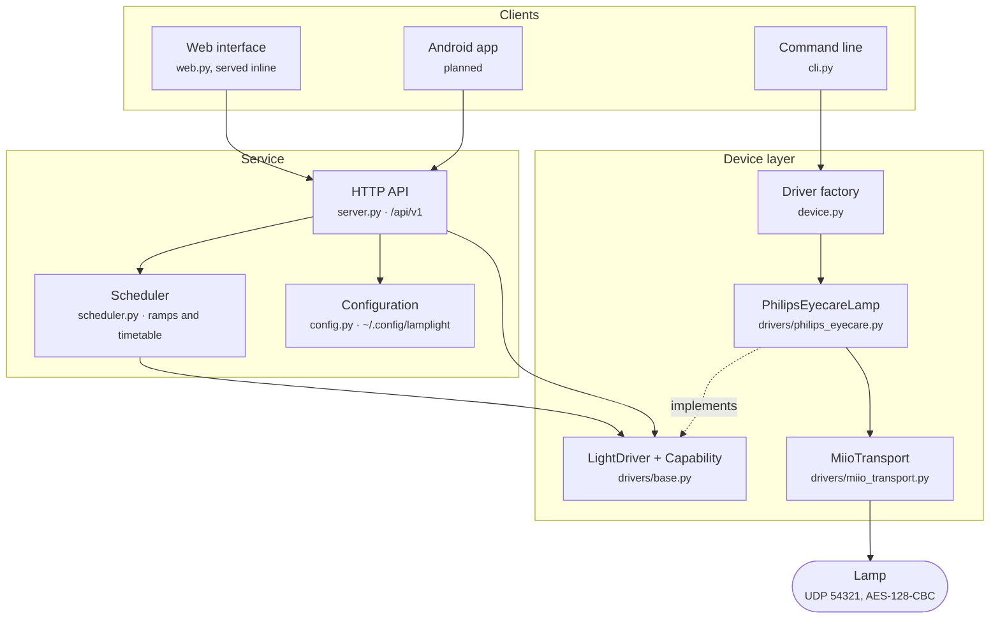

# Architecture

How lamplight is put together, and the reasoning behind each boundary. Read this before
changing anything structural.

## The shape of it

## Layers, and the rule between them

Each layer knows only about the one directly beneath it. The rule that matters:

> Nothing above `drivers/` may mention a specific device, a specific miIO command, or a
> specific model string.

The scheduler asks a `LightDriver` to `set_brightness(50)`. It has no idea that this
becomes `set_bright` in a JSON payload, encrypted with a key derived from a token, and
sent as a UDP datagram. That separation is what makes a second device type a new file
rather than a rewrite.

| Layer | Module | Responsibility | Knows about |
|---|---|---|---|
| Transport | `drivers/miio_transport.py` | Bytes on the wire, retry, rediscovery | UDP, AES, tokens |
| Contract | `drivers/base.py` | What a light can do | Nothing device-specific |
| Driver | `drivers/philips_eyecare.py` | One device's command set and quirks | miIO method names |
| Factory | `device.py` | Configuration to a working driver | The model registry |
| Behaviour | `scheduler.py` | Ramps and the timetable | The abstract driver only |
| Interface | `server.py`, `cli.py`, `web.py` | Presentation | The abstract driver only |

## Four decisions worth understanding

### Capabilities are data, not assumptions

A driver declares a `frozenset[Capability]`. The API publishes it at
`GET /api/v1/device`, the web interface hides any control whose `data-cap` is absent from
that set, and calling an unsupported operation returns HTTP 400 rather than a confusing
protocol error.

The alternative, letting each client hard-code what a device can do, requires every client
to be updated in step whenever a device is added. A native mobile client cannot be updated
on demand, so that approach is not viable here.

### The transport is a protocol, not a base class

`Transport` is a `typing.Protocol`. Anything with `send`, `info` and `address` satisfies
it, so `tests/fakes.py` provides an in-memory device and the entire suite runs with no
hardware and no network. That is not only convenient for CI; it means the two firmware
quirks below have regression tests, which would be impossible against real hardware in a
pipeline.

### The service is built by a factory

`server.py` exposes `create_app(config, driver, scheduler)`. The module-level `app` that
`uvicorn lamplight.server:app` resolves is built lazily through a module `__getattr__`, so
importing the module contacts nothing.

Constructing the driver at module scope makes the HTTP layer untestable, because importing
it then contacts hardware. That is why device construction is not there.

### Ramps run in threads, and cancellation is explicit

The scheduler runs one daemon thread for the timetable, checking every 20 seconds, and one
short-lived thread per ramp. A ramp holds no lock between steps, so a twenty-minute
sunrise does not block the interface. All device access is serialised inside the transport
by a single `RLock`, because these devices do not tolerate concurrent requests.

Any manual command cancels a running ramp. Someone reaching for the brightness slider
during a sunrise means it, and having the ramp fight them would be indefensible.

## Threading model

| Thread | Started by | Lifetime | Purpose |
|---|---|---|---|
| Main / event loop | `uvicorn` | Process | Serves HTTP |
| Request workers | FastAPI thread pool | Per request | Route handlers, defined with `def` so blocking UDP is safe |
| `scheduler` | `Scheduler.start()` | Process | Evaluates the timetable every 20 seconds |
| `ramp-<kind>` | Each ramp | Ramp duration | Steps brightness, cancellable |

Route handlers are deliberately synchronous. The driver beneath them blocks on UDP, and
`async def` handlers would block the event loop instead of a worker thread.

## What state exists, and where

| State | Location | Notes |
|---|---|---|
| Device address, token, model | `~/.config/lamplight/config.json` | Mode `0600`. Contains a credential. |
| Schedules | Same file | Written atomically through a temporary file and a rename |
| Ramp in progress | Memory | Deliberately not persisted; see below |
| Device state | The device | Never cached, always read live |

Ramp progress is not persisted. Resuming a half-finished sunrise after a restart would
mean guessing whether the user still wants it, and the honest answer is that nobody
knows. A `timer` schedule, which the device tracks itself, is the durable option and is
labelled as such throughout.

Device state is never cached. A lamp has a physical touch control, so any cache would go
stale the moment somebody touched it.

## The two firmware quirks

Measured on firmware 1.2.8, undocumented by the vendor, and the reason
`_preserve_brightness` exists in the driver:

1. `set_eyecare` resets `bright` to a stored value. Observed 25 becoming 53.
2. `delay_off` resets `bright` as well. Observed 53 becoming 70.

The driver reads brightness before either call and re-applies it if the firmware moved it.
`tests/test_drivers.py` covers both, and `tests/fakes.py` reproduces the misbehaviour on
purpose, so a fake that behaved better than the hardware cannot let the compensation rot.

## Extending it

| Goal | Where to work | Guide |
|---|---|---|
| Another miIO light | A new module in `drivers/` | [DEVICES.md](DEVICES.md) |
| A non-miIO device | A new `Transport`, plus a driver | [DEVICES.md](DEVICES.md) |
| A new capability | Add to `Capability`, then to drivers that have it | [DEVICES.md](DEVICES.md) |
| A client | Consume `/api/v1` | [API.md](API.md) |
| Multiple devices at once | See the note below | [ROADMAP.md](ROADMAP.md) |

### On multiple devices

The current service handles exactly one device. The driver layer is already
device-agnostic, so the change is confined to configuration and routing: `DeviceConfig`
becomes a list, and the API grows `/api/v1/devices/{id}/...` with the present routes kept
as an alias for the default device.

That work is deliberately deferred rather than half-built. A partial implementation would
mean shipping an API that has to change again once the shape is understood, which is the
one thing a versioned contract exists to prevent.
